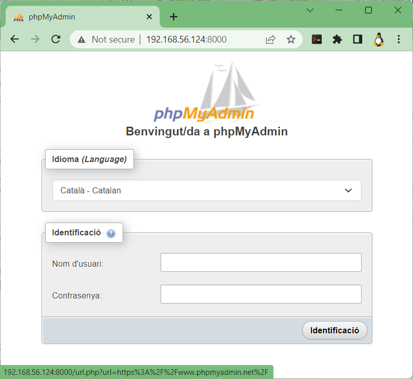
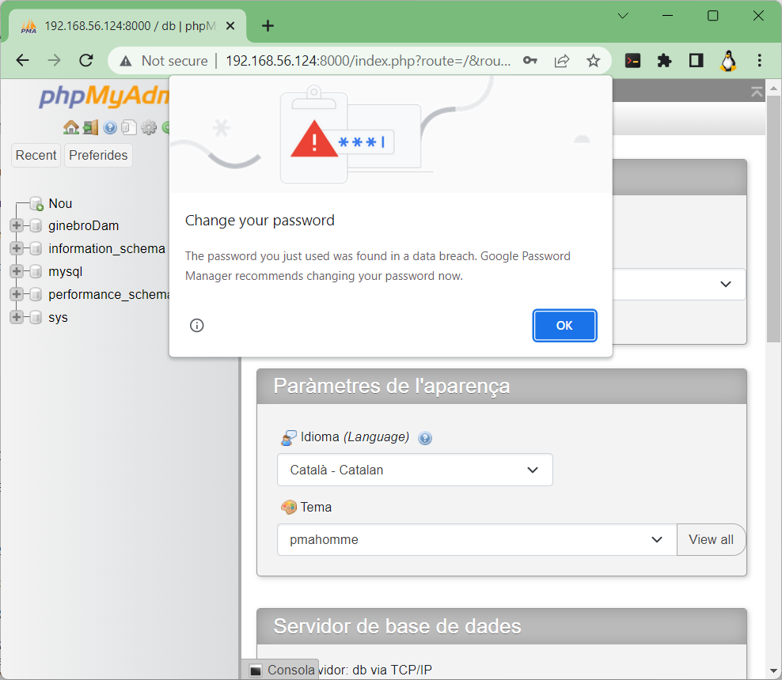
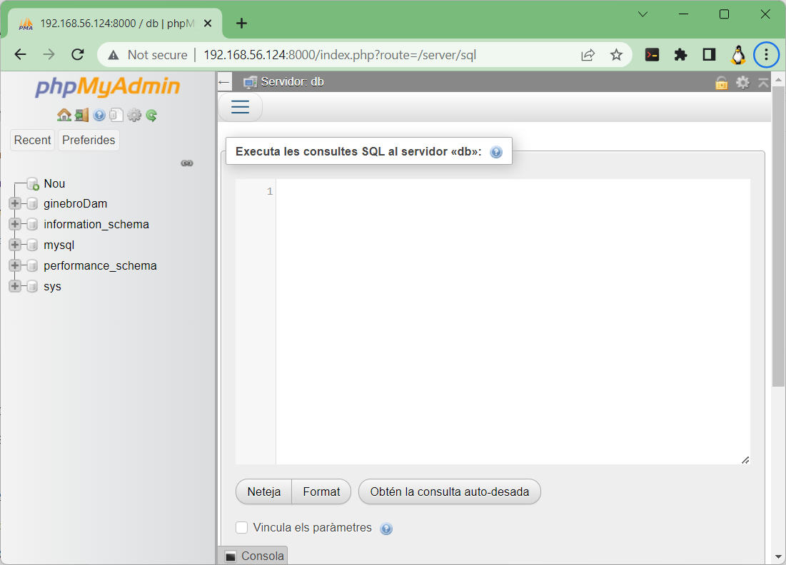

## Per aquest examen cal que:

### **Pas 1.** creeu un repositori en el vostre compte de [**```github.com```**](github.com) amb les següents caracteristiques:

* ## *tipus*: **privat**,
* ## *amb el nom*: **```<CognomAlumne>-examen-20230202```** (important respectar tant els guions com les majúscules o minúscules del nom del repositori.), us recordo que a on diu **```<CognomAlumne>```** vol dir que cal escriure el cognom de l'alumne, **sense el nom de l'alumne**.

## Durant tota l'activitat:
>  |Cadena|significa|
>  |---|---|
>  |**```<CognomAlumne>```**|cognom de l'alumne **sense el nom de l'alumne**|
>  |**```<nomUsuariGitHub>```**|nom de l'usuari de l'alumne al [**github.com**](https://github.com)|
>  |**```<nomRepositoriRemot>```**|nom del repositori de l'alumne al [**github.com**](https://github.com)|

<br>

### **Pas 2.** convideu al repositori a l'usuari **```joanpardogine```**

<br>

### **Pas 3.** A la vostra màquina virtual a on teniu el **```docker```** instal·lat, cal que tingeu descarregades les següents imatges de **```docker```**:

```sh
mysql:8.0
phpmyadmin/phpmyadmin
php:8.0.0-apache
```

<br>

## Pasos per inicialitzar l'entorn de l'examen.

### En el vostre **repositori local** (**és a dir en el vostre ordinador**)

1. Creació de la carpeta que serà:

```sh
mkdir ~/<CognomAlumne>-examen-20230202
cd ~/<CognomAlumne>-examen-20230202
```

### Us recordo els passos a fer al vostre **repositori local** per vincular-lo al **repositori remot** que acabeu de crear.

> # ***Presuposo***:
> ## **1)** que el **nom de la branca** del vostre repositori és **```main```**.
> ## **2)** que el vostre **repositori local** ja el teniu incicialitzat, és a dir que ja heu fet el **```git init```**.

<br>

```sh
$ echo <CognomAlumne>-examen-20230202 > README.md
$ git add README.md
$ git commit -m "Primer commit de l'examen!"
$ git remote add origin https://github.com/<nomUsuariGitHub>/<nomRepositoriRemot>
$ git push -u origin main
```

### En el vostre **repositori remot** (**és a dir en el **vostre servidor virtual** amb el **```docker```** instal·lat**)

**1.** Creació de la carpeta en el **vostre servidor virtual** amb el **```docker```** instal·lat**:

```sh
user@server:~$ mkdir ~/<CognomAlumne>-examen-20230202
user@server:~$ cd ~/<CognomAlumne>-examen-20230202
user@server:~/<CognomAlumne>-examen-20230202$
```

**2.** Descarrega del fitxer comprimit amb dades per poder fer l'examen en el **vostre servidor virtual** amb el **```docker```** instal·lat**)

```sh
wget https://github.com/joanpardogine/examen-20230202/archive/refs/heads/main.zip
```

**3.** Actualització del vostre SO i instal·lació d'eines en el **vostre servidor virtual**:

```sh
sudo apt-get update
sudo apt-get install tar gzip zip unzip bzip2
sudo unzip main.zip
sudo rm main.zip
sudo unzip ./examen-20230202-main/main.zip
sudo rm examen-20230202-main/main.zip
sudo rmdir examen-20230202-main
```

**CONTROL**: Si has seguit tots els passos correctament, la sortida a la següent comanda ```pwd``` en el **vostre servidor virtual**, ha de ser aquesta:

```sh
pwd
/home/<nomUsuariLinux>/<CognomAlumne>-examen-20230202
```

Dins de la carpeta **```~/<CognomAlumne>-examen-20230202```** hi ha tot un seguit de fitxers:

```sh
.
├── conf
├── docker-compose-bo.yml
├── docker-compose.yml
├── Dockerfile
├── dump
│   └── ginebroDam.sql
├── index.php
└── LICENSE
```

## El contingut del fitxer **```docker-compose.yml```** és:

```sh
version: "3.1"
services:
    www:
        build: .
        ports: 
            - "80:80"
        volumes:
            - ./www:/var/www/html
        links:
            - db
        networks:
            - default
    db:
        image: mysql:8.0
        ports: 
            - "3306:3306"
        command: --default-authentication-plugin=mysql_native_password
        environment:
            MYSQL_DATABASE: ginebroDam
            MYSQL_USER: root
            MYSQL_PASSWORD: secret
            MYSQL_ROOT_PASSWORD: secret
        volumes:
            - ./dump:/docker-entrypoint-initdb.d
            - ./conf:/etc/mysql/conf.d
            - persistent:/var/lib/mysql
        networks:
            - default
    phpmyadmin:
        image: phpmyadmin/phpmyadmin
        links: 
            - db:db
        ports:
            - 8000:80
        environment:
            MYSQL_USER: root
            MYSQL_PASSWORD: secret
            MYSQL_ROOT_PASSWORD: secret 
volumes:
    persistent:
```

## i el contingut del fitxer **```Dockerfile```** és:

```sh
FROM php:8.0.0-apache
ARG DEBIAN_FRONTEND=noninteractive
RUN docker-php-ext-install mysqli
RUN apt-get update \
    && apt-get install -y libzip-dev \
    && apt-get install -y zlib1g-dev \
    && rm -rf /var/lib/apt/lists/* \
    && docker-php-ext-install zip

RUN a2enmod rewrite
```

## **Pregunta 1**&nbsp;&nbsp;&nbsp;&nbsp;&nbsp;```(0,5 punts)```
# Amb la informació del contingut dels fitxers mostrada, em podries dir quantes imatges de **```docker```** farem servir?

## **Pregunta 2**&nbsp;&nbsp;&nbsp;&nbsp;&nbsp;```(0,5 punts)```
# Enumera quines són les imatges de **```docker```** farem servir.

## **Pregunta 3**&nbsp;&nbsp;&nbsp;&nbsp;&nbsp;```(0,5 punts)```
# Digues, de cada imatge, el **nom** (**```image-name:tag```**), la seva **mida** en **```MB```**, i l'**```ID```**. Explica quines comandes has fet servir per obtenir aquesta informació.

## **Pregunta 4**&nbsp;&nbsp;&nbsp;&nbsp;&nbsp;```(1,0 punt)```
# Que fa la comanda **```sudo docker-compose up -d```**?

## Executa la comanda **```sudo docker-compose up -d```**.

## **Pregunta 5**&nbsp;&nbsp;&nbsp;&nbsp;&nbsp;```(1,0 punts)```
## L'execució de  la comanda **```sudo docker-compose up -d```** genera la següent sortida:

```sh
Creating network "<CognomAlumne>-examen-20230202_default" with the default driver
Creating volume "<CognomAlumne>-examen-20230202_persistent" with default driver
Building www
Sending build context to Docker daemon  10.24kB
Step 1/5 : FROM php:8.0.0-apache
 ---> e97a1581dd75
Step 2/5 : ARG DEBIAN_FRONTEND=noninteractive
 ---> Running in 7a426642f8ea
Removing intermediate container 7a426642f8ea
 ---> 78c5a00ff03c
Step 3/5 : RUN docker-php-ext-install mysqli
 ---> Running in cfda51b6c91d
Configuring for:
PHP Api Version:         20200930
Zend Module Api No:      20200930
Zend Extension Api No:   420200930
checking for grep that handles long lines and -e... /bin/grep
...
find . -name .libs -a -type d|xargs rm -rf
rm -f libphp.la      modules/* libs/*
Removing intermediate container cfda51b6c91d
 ---> ae4faf33b916
Step 4/5 : RUN apt-get update     && apt-get install -y libzip-dev     && apt-get install -y zlib1g-dev     && rm -rf /var/lib/apt/lists/*     && docker-php-ext-install zip
 ---> Running in e737b152c5d9
Get:1 http://deb.debian.org/debian buster InRelease [122 kB]
...
rm -f libphp.la      modules/* libs/*
Removing intermediate container e737b152c5d9
 ---> eb4844da85d8
Step 5/5 : RUN a2enmod rewrite
 ---> Running in b3c147de6d6d
Enabling module rewrite.
To activate the new configuration, you need to run:
  service apache2 restart
Removing intermediate container b3c147de6d6d
 ---> f471b51e228f
Successfully built f471b51e228f
Successfully tagged <CognomAlumne>-examen-20230202_www:latest
WARNING: Image for service www was built because it did not already exist. To rebuild this image you must use `docker-compose build` or `docker-compose up --build`.
Creating <CognomAlumne>-examen-20230202_db_1 ... done
Creating <CognomAlumne>-examen-20230202_phpmyadmin_1 ... done
Creating <CognomAlumne>-examen-20230202_www_1        ... done
```

## Un cop executada la comanda **```sudo docker-compose up -d```**, tenim la següent informació.

## Segons la informació s'han creat tres contenidors.
```sh
Creating <CognomAlumne>-examen-20230202_db_1 ... done
Creating <CognomAlumne>-examen-20230202_phpmyadmin_1 ... done
Creating <CognomAlumne>-examen-20230202_www_1        ... done
```
## Executem la comanda per veure quins contenidor s'han creat.
```sh
 sudo docker ps
CONTAINER ID   IMAGE                       COMMAND                  CREATED         STATUS         PORTS                                   NAMES
9214a7162fed   phpmyadmin/phpmyadmin       "/docker-entrypoint.…"   4 minutes ago   Up 4 minutes   0.0.0.0:8000->80/tcp, :::8000->80/tcp   <CognomAlumne>-examen-20230202_phpmyadmin_1
7c2c0052ff8d   <CognomAlumne>-examen-20230202_www   "docker-php-entrypoi…"   4 minutes ago   Up 4 minutes   0.0.0.0:80->80/tcp, :::80->80/tcp       <CognomAlumne>-examen-20230202_www_1
```

## Segons la informació s'havien creat tres contenidors, pero només apareixen dos que estiguin executant-se.

```sh
 sudo docker ps -a
 CONTAINER ID   IMAGE                       COMMAND                  CREATED         STATUS                     PORTS                                   NAMES
9214a7162fed   phpmyadmin/phpmyadmin       "/docker-entrypoint.…"   4 minutes ago   Up 4 minutes               0.0.0.0:8000->80/tcp, :::8000->80/tcp   <CognomAlumne>-examen-20230202_phpmyadmin_1
7c2c0052ff8d   <CognomAlumne>-examen-20230202_www   "docker-php-entrypoi…"   4 minutes ago   Up 4 minutes               0.0.0.0:80->80/tcp, :::80->80/tcp       <CognomAlumne>-examen-20230202_www_1
29fbfcc28971   mysql:8.0                   "docker-entrypoint.s…"   4 minutes ago   Exited (1) 4 minutes ago                                           <CognomAlumne>-examen-20230202_db_1
```
## **Pregunta 6**&nbsp;&nbsp;&nbsp;&nbsp;&nbsp;```(1,0 punt)```
## Quina comanda de **```docker```** podries executar per esbrinar què és el que ha passat?

## **Pregunta 7**&nbsp;&nbsp;&nbsp;&nbsp;&nbsp;```(1,0 punt)```
## Què és el que li ha passsat al contenidor **```<CognomAlumne>-examen-20230202_db_1```**? (Raona la teva resposta)


## **Pregunta 8**&nbsp;&nbsp;&nbsp;&nbsp;&nbsp;```(0,5 punts)```
## Explica el més detallat possible, què és el que fa la següent comanda?

```sh
sudo docker ps -aq
```

## **Pregunta 9**&nbsp;&nbsp;&nbsp;&nbsp;&nbsp;```(0,5 punts)```
## Explica el més detallat possible, què és el que fa la següent comanda?

```sh
sudo docker stop $(sudo docker ps -aq)
```

## Executa les següents comandes: 
```sh
sudo cp docker-compose-bo.yml docker-compose.yml
sudo docker stop $(sudo docker ps -aq)
sudo docker rm $(sudo docker ps -aq)
sudo docker image rm <CognomAlumne>-examen-20230202_www
```

## Torna a executar la comanda  **```sudo docker-compose up -d```**

## Un cop executada la comanda **```sudo docker-compose up -d```**, tenim la següent informació.

## Segons la informació s'han creat tres contenidors.
```sh
Creating <CognomAlumne>-examen-20230202_db_1 ... done
Creating <CognomAlumne>-examen-20230202_phpmyadmin_1 ... done
Creating <CognomAlumne>-examen-20230202_www_1        ... done
```

## Executem la comanda per veure quins contenidor s'han creat.
```sh
 sudo docker ps
CONTAINER ID   IMAGE                       COMMAND                  CREATED         STATUS         PORTS                                   NAMES
CONTAINER ID   IMAGE                       COMMAND                  CREATED              STATUS              PORTS                                                  NAMES
abeb06ad478e   phpmyadmin/phpmyadmin       "/docker-entrypoint.…"   About a minute ago   Up 54 seconds       0.0.0.0:8000->80/tcp, :::8000->80/tcp                  <CognomAlumne>-examen-20230202_phpmyadmin_1
9fdd461b4c10   <CognomAlumne>-examen-20230202_www   "docker-php-entrypoi…"   About a minute ago   Up 54 seconds       0.0.0.0:80->80/tcp, :::80->80/tcp                      <CognomAlumne>-examen-20230202_www_1
450f373ea6af   mysql:8.0                   "docker-entrypoint.s…"   About a minute ago   Up About a minute   0.0.0.0:3306->3306/tcp, :::3306->3306/tcp, 33060/tcp   <CognomAlumne>-examen-20230202_db_1
```

## **Pregunta 10**&nbsp;&nbsp;&nbsp;&nbsp;&nbsp;```(0,5 punts)```
## Què fa la següent comanda?
```sh
sudo docker images
```

## **Pregunta 11**&nbsp;&nbsp;&nbsp;&nbsp;&nbsp;```(1,0 punts)```
## Què fa la següent comanda?
```sh
docker-compose build
```

## Connectat al contenidor que conté el servidor de **```phpmyadmin```**.



## **Pregunta 12**&nbsp;&nbsp;&nbsp;&nbsp;&nbsp;```(0,5 punts)```
## Amb quin usuari i contrasenya et caldrà per accedir?


## **Pregunta 13**&nbsp;&nbsp;&nbsp;&nbsp;&nbsp;```(0,5 punts)```
## Explica, el més detallat possible, a on has obtingut tant l'usuari com la contrasenya per accedir al servidor de **```phpmyadmin```**.

## Quan accedeixis t'apareixerà el misssatge d'error,



## **Pregunta 14**&nbsp;&nbsp;&nbsp;&nbsp;&nbsp;```(0,5 punts)```
## Explica que creus que vol dir el misatge que apreaix com error!

## La finestra d'error la pots acceptar pitjant el botó **```Ok```**.

## A continuació, accedeix a l'apartat de SQL i exceuta el contingut del fitxer [ginebroDam.sql](./dump/ginebroDam.sql).



## Un cop ja t'aparegi la base de dades **```ginebroDam```** a la esquerra del **```phpmyadmin```**, accedeix a la carpeta **```www```** i crea el fitxer **```index.php```** amb la següent contingut:

```php
<?php
$mysqli = new mysqli("db","root","secret","ginebroDam");

$sql = "SELECT PROFESSORS.nomProfe, PROFESSORS.cognomProfe, MODULS.nomModul\n"
    . "FROM PROFESSORS\n"
    . " LEFT JOIN MODULS ON MODULS.codiProfe = PROFESSORS.codiProfe\n"
    . "    ORDER BY MODULS.nomModul;";

// Check connection
if ($mysqli -> connect_errno) {
    echo "Ha fallat la connexió amb el MySQL: " . $mysqli -> connect_error;
  exit();
}

$result = mysqli_query($mysqli, $sql);

// * fetch associative array */
while ($row = mysqli_fetch_row($result)) {
    printf("<p>El professor %s %s fa classe de %s.</p>", $row[0], $row[1], $row[2]);
}

$mysqli -> close();
?>
```

## **Pregunta 15**&nbsp;&nbsp;&nbsp;&nbsp;&nbsp;```(0,5 punts)```
## A on hauràs d'accedir per veure el que mostra l'execució del fitxer **```index.php```** que acabes de crear?
## Explica a on has accedit i què has consultat per obtenir la informació que t'ha premès veure el resultat l'execució del fitxer **```index.php```**.
